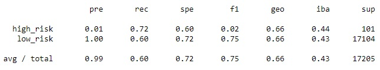

# Credit_Risk_Analysis
Module 18 Challenge - Supervised Machine Learning

## Resources
Operating Platform: Windows 11 Pro - Build 22621 [Buy Windows 11 Pro](https://www.microsoft.com/en-us/d/windows-11-pro/dg7gmgf0d8h4?rtc=1)</br>
IDE Software: [Jupyter Notebook](https://jupyter.org/) Verison 6.5.2 ()</br>
Python Kernel: 3.7.13</br>
Completed Jupyter Notebooks: [credit_risk_resampling](credit_risk_resampling.ipynb), [credit_risk_ensemble](credit_risk_ensemble.ipynb)</br>
Resource files: [LoanStats](/Resources/LoanStats_2019Q1.csv)

## Overview
Using the credit card credit dataset from LendingClub, a peer-to-peer lending services company, I'll oversample the data using the ```RandomOverSampler``` and ```SMOTE``` algorithms, and undersample the data using the ```ClusterCentroids``` algorithm. Then, you’ll use a combinatorial approach of over and undersampling using the ```SMOTEENN``` algorithm. Next, you’ll compare two new machine learning models that reduce bias, ```BalancedRandomForestClassifier``` and ```EasyEnsembleClassifier```, to predict credit risk.
Below is a list of tasks which will be completed: 
* Use Resampling Models to Predict Credit Risk.
* Use the SMOTEENN Algorithm to Predict Credit Risk.
* Use Ensemble Classifiers to Predict Credit Risk.

## Summary of different Machine Learning Algarythims
Result from RandomOverSampler </br>
* Accuracy = 66.20% </br>
* Precision = 99% </br>
* Recall = 60% </br>

</br>
Result from SMOTE </br>
* Accuracy = 65.68%
* Precision = 99%
* Recall = 69%

</br>
</br>
Result from RandomUnderSampler </br>
* Accuracy = 60.27% </br>
* Precision = 99% </br>
* Recall = 59% </br>
</br>
</br>

</br>
Result from SMOTEENN </br>
* Accuracy = 64.61%</br>
* Precision = 99%</br>
* Recall = 57%</br>
</br>
</br>
Result from BalancedRandomForestClassifier </br>
* Accuracy = 78.85%</br>
* Precision = 99%</br>
* Recall = 87%</br>
</br></br>
</br>
</br>
Result from EasyEnsembleClassifier </br>
* Accuracy = 93.16%</br>
* Precision = 99%</br>
* Recall = 94%</br>
</br>

## Summary 
After reviewing and checking 6 different machine learning methods the best one suited to the data is the ```EasyEnsembleClassifier``` module from ```imblearn.ensemble```. This method had the highest accuracy score of 93.16%. 

## Recommendations
There could be other, more efficent machine learning modules yet discovered which can better suite the needs of the project. Determining the parameters will ultimately yield if this module will work. Knowning the offical accuracy range (96% to 99%) that is required to meet the needs of the department or group can help focus on 2 or 3 different machine learning methods which could be tested against real data for speed and accuracy. 
